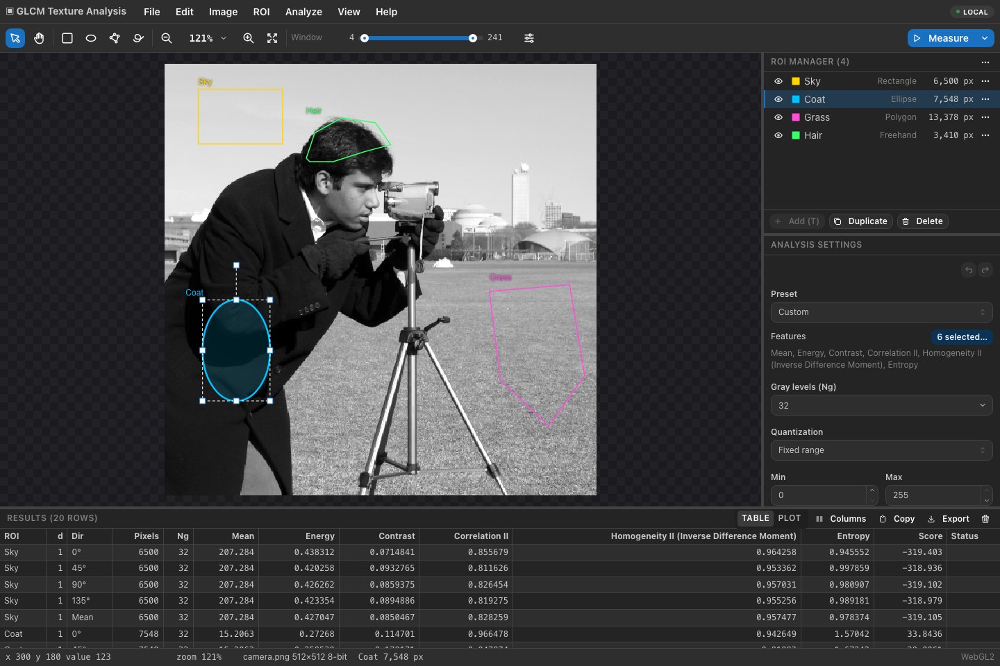

# Texture Workbench

Texture Workbench measures the **texture** of regions in grayscale images: how smooth, coarse, uniform or directional a tissue, material or surface looks. It turns that into numbers you can compare between regions and images. It runs in your web browser, on your own computer or on a server shared by a team.

<p align="center">
  
</p>

## What you can do

- **Open images:** PNG, JPEG, BMP or TIFF, 8 or 16 bits per pixel, including medical images such as CT, MRI, X-rays and mammograms. Adjust brightness and contrast, and view them in gray, inverted or in pseudo-colour.
- **Mark regions of interest (ROIs):** draw rectangles, ellipses, polygons or freehand outlines. Select regions by intensity with the magic wand or a threshold, and paint, erase, merge or cut ROIs.
- **Measure texture:** features from six established families (below), with presets for common choices.
- **Look at the results:** a sortable results table, bar, box and polar plots, and feature maps that colour the whole image by a texture feature.
- **Work in batches and keep your work:** measure the same ROIs on many images, export the results as CSV or JSON, and save projects that bring everything back later.

## Texture features

| Family | For example |
| --- | --- |
| First-order statistics | mean, median, percentiles, skewness, kurtosis, entropy |
| Co-occurrence (GLCM, Haralick) | contrast, correlation, energy, homogeneity, entropy |
| Run length (GLRLM) | short and long run emphasis, run entropy |
| Size zone (GLSZM) | small and large area emphasis, zone entropy |
| Gray tone difference (NGTDM) | coarseness, busyness, complexity |
| Local binary patterns (LBP) | uniform pattern fractions, LBP entropy |

The features follow their published definitions and are tested against [PyRadiomics](https://pyradiomics.readthedocs.io/) and [scikit-image](https://scikit-image.org/). The documentation gives the formula of every feature.

## Getting started

You need [Node.js](https://nodejs.org/) 24 or newer, CMake, a C++ compiler, and the OpenCV, Eigen and nlohmann/json libraries. On macOS with [Homebrew](https://brew.sh/):

```bash
brew install cmake opencv eigen nlohmann-json node
```

Then, in the folder of this repository:

```bash
npm install
npm run build:native
npm run build:web
npm start
```

Open http://127.0.0.1:8080/ in your browser and click **Open sample image**.

For Linux, running the tests, and running the application as a shared server with Docker, see [DEVELOPMENT.md](DEVELOPMENT.md).

## Your first measurement

1. **Open an image:** *File ▸ Open Image*, drag a file onto the window, or open a sample image.
2. **Draw a region:** pick the rectangle tool (`R`) and drag over the image, then press `T` to add the region to the ROI Manager.
3. **Choose features:** in *Analysis Settings*, pick a preset or the features you want.
4. **Measure:** press `M`. The results appear in the table below the image.
5. **Keep the results:** *File ▸ Export Results as CSV*, or *File ▸ Save Project* to keep the image, regions, settings and results together.

## Documentation

The documentation in [`doc/`](doc/) has three parts:

- **User guide:** every tool, menu and setting, with screenshots and a keyboard reference.
- **Texture features:** the exact equations and the literature they come from.
- **Developer guide:** how the application is built, its programming interfaces and file formats.

Once it is built, the running application also serves it at http://127.0.0.1:8080/docs/. How to build it is described in [DEVELOPMENT.md](DEVELOPMENT.md#documentation).

## Sample images

The [`samples/`](samples/) folder has images to try: synthetic test patterns, natural textures, and de-identified medical images (chest and abdominal CT, brain MRI, a chest X-ray and a mammogram). [`samples/README.md`](samples/README.md) describes each image and its source.

## License

Texture Workbench is free and open-source software, released under the [MIT License](LICENSE). You may use, copy, modify and distribute it, including in commercial and closed-source software, as long as the copyright notice and the license text are kept.

Exceptions:
- **Sample images from other sources:** the images in `samples/textures/` come from scikit-image (CC0 or no known copyright restrictions), and those in `samples/medical/` from The Cancer Imaging Archive (CC BY 3.0 and CC BY 4.0, with required citations) and OpenNeuro (CC0). They keep their own licenses. See [`samples/README.md`](samples/README.md).
- **Dependencies:** OpenCV, Eigen, nlohmann/json, Node.js packages and the other dependencies are distributed under their own licenses.

## References

- R. M. Haralick, K. Shanmugam and I. Dinstein, "Textural Features for Image Classification," *IEEE Transactions on Systems, Man, and Cybernetics*, SMC-3(6), 1973.

See [`doc/references.rst`](doc/references.rst) (or the References page of the built documentation) for the full list.
