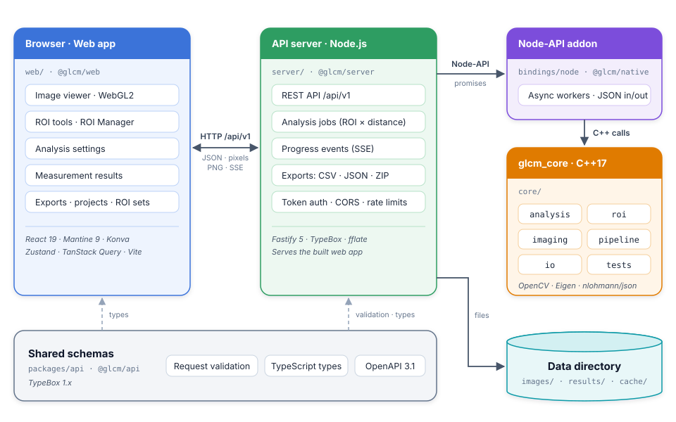

.. _architecture:

Architecture
============

Overview
--------

The application is a client–server web application with the numerical work in a C++ library:

         Server-Sent Events. The server calls the Node-API addon, which calls the glcm_core C++ library, and stores
         images, results and caches in the data directory. Shared TypeBox schemas provide request validation,
         TypeScript types and the OpenAPI document.
   :align: center
   :width: 100%

   Components of the application. Solid arrows are calls and data; dashed arrows show where the shared schemas are
   used.

- ``glcm_core`` is the single source of the numbers: ROI masks, quantization, GLCM features, the age-based score,
  display rendering and the CSV, JSON and ROI image exporters. It has no UI or web dependencies and is tested with
  GoogleTest.
- The **addon** exposes ``glcm_core`` to Node.js. Slow calls run on worker threads and return promises.
- The **server** stores images and results, runs analyses as jobs, streams progress, produces exports, enforces
  authentication and limits, and serves the built web app.
- The **web app** shows the image, lets users draw and manage ROIs, edit settings, measure and export. It never
  computes masks or features itself; pixel counts shown in the ROI Manager come from the server.
- ``@glcm/api`` holds the request and response schemas. The server validates and serializes with them, the OpenAPI
  document is generated from them, and the web app uses their TypeScript types.

The same build runs in two modes (see ``doc/deployment.md``): **local mode** on a loopback address without
authentication, started with ``npm start``, and **server mode** on any other address, which requires an access token
and is usually run with Docker.

Repository layout
-----------------

.. list-table::
   :header-rows: 1
   :widths: 25 75

   * - Path
     - Contents
   * - ``core/``
     - ``glcm_core`` static library (``analysis/``, ``roi/``, ``imaging/``, ``pipeline/``, ``io/``) and ``tests/``
   * - ``bindings/node/``
     - ``@glcm/native``: ``src/addon.cpp``, ``index.js``, ``index.d.ts``, tests; built with cmake-js
   * - ``packages/api/``
     - ``@glcm/api``: ``src/schemas.ts`` (system, images), ``src/analysis.ts`` (ROIs, settings, results),
       ``src/exports.ts`` (exports, file formats), ``src/windowLevel.ts``, generated ``openapi.json``
   * - ``server/``
     - ``@glcm/server``: ``src/app.ts``, ``config.ts``, ``security.ts``, ``routes/``, ``analysis/JobManager.ts``,
       ``storage/``, ``web.ts``; tests use ``fastify.inject``
   * - ``web/``
     - ``@glcm/web``: ``src/`` grouped by concern (``api/``, ``viewer/``, ``image/``, ``rois/``, ``analysis/``,
       ``results/``, ``files/``, ``batch/``, ``stores/``, ``components/``)
   * - ``e2e/``
     - Playwright tests against the built app and real servers
   * - ``samples/``, ``scripts/``
     - Sample images (``scripts/generate-samples.ts`` makes the synthetic ones, ``scripts/fetch-medical-samples.py`` the medical ones) and the Docker smoke test
   * - ``doc/``
     - This documentation, the design plan and the deployment guide
   * - ``Dockerfile``, ``compose.yaml``, ``.github/workflows/``
     - Server image, deployment example, continuous integration

The JavaScript packages are **npm workspaces**: ``node_modules/@glcm/*`` link to ``packages/api``, ``bindings/node``,
``server`` and ``web``. The server and the web app import the TypeScript sources of ``@glcm/api`` directly (through
``tsx`` and Vite), so there is no separate build step for it.

C++ core library
----------------

Namespace ``glcm``; include paths are relative to ``core/``.

.. list-table::
   :header-rows: 1
   :widths: 22 78

   * - Module
     - Responsibility
   * - ``analysis/TextureAnalysis``
     - Counts pixel pairs of a (masked) ``CV_8UC1`` image in the four directions (0°, 45°, 90°, 135°) at a distance,
       normalizes the matrices and computes the features of :doc:`../equations`. ``TextureOptions`` select directions
       (the others are NaN) and the logarithm base. ``Features`` holds one value per direction with ``Avg()`` and
       ``Range()``.
   * - ``analysis/Score``
     - The age-based score from mean, entropy and contrast with configurable ``ScoreCoefficients``.
   * - ``roi/Roi``
     - Rectangle, ellipse and polygon shapes in image pixel coordinates. ``RasterizeMask`` (and ``RasterizeCroppedMask``, which rasterizes only a box around the shape so small ROIs on large images are fast) uses the pixel-centre rule:
       a pixel belongs to the ROI when its centre ``(c + 0.5, r + 0.5)`` lies inside the shape.
   * - ``imaging/ImageLoader``
     - Decodes PNG, JPEG, BMP and 8/16-bit TIFF with OpenCV and converts color to grayscale (with a warning).
   * - ``imaging/Quantizer``
     - Maps intensities to ``[0, Ng)`` with integer arithmetic: fixed range, ROI min–max, fixed bin width or none.
   * - ``imaging/DisplayRenderer``
     - Display statistics (default window, histogram), ``WindowLevel`` and the 8-bit rendering behind ``display.png``.
   * - ``pipeline/FeatureCatalog``
     - Feature ids, names, groups, non-standard flags, documentation anchors, cost classes and presets.
   * - ``pipeline/AnalysisSettings``
     - Features, gray levels, quantization, distances, directions, aggregation, log base and score settings, with
       ``DefaultSettings`` and ``ValidateSettings``.
   * - ``pipeline/AnalysisRunner``
     - ``RunAnalysis`` measures every ROI at every distance: region statistics from the original intensities,
       quantization, texture features, the score (calibration or current-settings profile), warnings, and
       ``Skipped``/``Failed`` results instead of exceptions for single ROIs.
   * - ``io/``
     - ``Identifiers`` (text ids of enumerations), ``Json`` (ROI sets, settings, results documents in both
       directions), ``ResultsCsv``, ``RoiImageExport``.

Node.js addon
-------------

``bindings/node/src/addon.cpp`` uses node-addon-api with C++ exceptions. Each slow call is a ``Napi::AsyncWorker``
that runs on the libuv thread pool and settles a promise; failures reject with an ``Error`` whose ``code`` is
``INVALID_ARGUMENT``, ``UNSUPPORTED_IMAGE``, ``IMAGE_TOO_LARGE``, ``DECODE_FAILED`` or ``INTERNAL_ERROR``. Workers that read pixels keep
a reference to the JavaScript buffer and wrap it as a ``cv::Mat`` without copying when possible.

ROIs, settings and results cross the boundary as **JSON text** in the formats of ``core/io/Json``, so the C++ parser
validates them and the addon needs no per-field conversion code. Pixel data crosses as buffers of row-major samples,
16-bit samples little-endian. The functions are listed in :ref:`api-addon`.

API server
----------

``server/src/app.ts`` builds the Fastify application (``buildApp(config)``); ``main.ts`` loads and validates the
configuration, starts retention and listens. Plugins and hooks are registered in this order:

#. ``@fastify/swagger`` (OpenAPI generation) and ``@fastify/multipart`` (uploads).
#. The error handler, which turns ``ApiError``, validation errors and plugin errors into ``{error, message}``.
#. In server mode or when configured: CORS allow-list, rate limit, bearer-token authentication (``security.ts``).
#. ``@fastify/static`` for ``web/dist`` and a not-found handler that returns ``index.html`` for page requests and a
   JSON 404 for everything else.
#. The route plugins under ``/api/v1``: ``health``, ``catalog``, ``images``, ``analyses``, ``exports``, ``samples``.

.. rubric:: Configuration and modes

``config.ts`` reads ``GLCM_*`` environment variables. A loopback ``GLCM_HOST`` is local mode; any other address is
server mode, which has stricter defaults and refuses to start without a strong ``GLCM_API_TOKEN``
(``validateConfig``).

.. rubric:: Analysis jobs

``analysis/JobManager.ts`` splits an analysis into **one job per ROI × distance** and runs the jobs of all analyses with
``GLCM_ANALYSIS_CONCURRENCY`` workers. Analyses **take turns**, one job each, so a large analysis does not hold up
smaller ones started after it. At most ``GLCM_MAX_PENDING_JOBS`` jobs are queued or running: a larger analysis is
refused (``422 TooManyJobs``), and while the queue is full new analyses get ``503 ServerBusy``. Each job calls the
addon's ``runAnalysis`` with one ROI and one distance; results are stored by position (ROI order, then distance order). The manager emits ``result``, ``progress``
and ``finished`` events, which ``GET /analyses/{id}/events`` streams as Server-Sent Events. Cancelling drops queued
jobs; running jobs finish. Finished analyses stay in memory (up to 100) and are written to ``results/`` so that they
survive restarts; closing the server waits for these writes (``JobManager.flush``).

.. rubric:: Storage

All files live under ``GLCM_DATA_DIR`` with random names:

.. code-block:: text

   images/img_<32 hex>/original       the uploaded file (SHA-256 recorded in info.json)
   images/img_<32 hex>/pixels.bin     decoded grayscale samples, row-major, 16-bit little-endian
   images/img_<32 hex>/pixels.bin.gzip, pixels.bin.zstd
                                      compressed copies for GET /raw, created on first request
   images/img_<32 hex>/info.json      ImageInfo
   results/ana_<32 hex>.json          finished analysis: AnalysisInfo and results
   cache/display/<sha256>.png         size-capped LRU of display.png renderings
   uploads/                           uploads in progress (emptied at startup)

``storage/retention.ts`` deletes images uploaded and analyses finished longer ago than ``GLCM_RETENTION_HOURS``.

.. rubric:: Security

Authentication is an ``onRequest`` hook: every ``/api/v1`` request except ``GET /health`` and CORS preflights needs
``Authorization: Bearer <token>``. The server compares SHA-256 digests of the presented and expected token with
``timingSafeEqual`` and answers ``401`` without details. Rate limits are keyed by the token digest (or the client
address). The web app's static files are public, so the app can ask for the token. See ``doc/deployment.md`` for the
complete checklist.

Web app
-------

The web app is a single page built with Vite. ``App.tsx`` lays out the menu bar, toolbar, image canvas, ROI Manager,
Analysis Settings, Results table and status bar in resizable panels.

.. rubric:: State

State lives in small **Zustand** stores; components select the values they render, and actions that involve several
stores are plain functions (``app/actions.ts``, ``analysis/measure.ts``, ``files/actions.ts``).

.. list-table::
   :header-rows: 1
   :widths: 30 70

   * - Store
     - Holds
   * - ``stores/viewerStore``
     - Open image, window/level, viewport (scale and offset), view size, tool, navigator, hover readout, display source
   * - ``rois/roiStore``
     - ROIs, selection, hover, the active (drawn but not yet added) shape, undo/redo snapshots (200 steps)
   * - ``results/resultsStore``
     - Analysis runs with their settings and results, and the table rows derived from them
   * - ``batch/batchStore``
     - The batch measurement in progress: one status per image; kept outside the dialog, so closing it does not stop the
       batch
   * - ``analysis/settingsStore``
     - Analysis settings, persisted in ``localStorage``
   * - ``api/auth``
     - Access token (``sessionStorage``) and whether the token prompt is open
   * - ``stores/uiStore``, ``stores/preferences``
     - Open dialog, file dialog requests, ROI labels; scroll behaviour and renderer preference

.. rubric:: Results table and plots

``results/ResultsPanel.tsx`` shows the runs either as the table (rows from ``results/rows.ts``) or as plots
(``results/ResultsPlot.tsx``). The plots are drawn as plain SVG, without a chart library. ``results/plotData.ts`` reads
the per-direction values from the runs rather than the table rows, so every aggregation can be plotted; it keeps the
latest measurement per image, ROI and distance, and computes box plot quartiles (linear interpolation) and axis scales.
``results/svgExport.ts`` resolves the theme's CSS colours when a chart is saved as SVG.

Server data that is not user state (feature catalog, sample list, ROI statistics) is loaded with **TanStack Query**.
All API calls go through ``api/client.ts`` and ``apiFetch``, which adds the access token.

.. rubric:: Image canvas

``viewer/ImageCanvas.tsx`` draws a **Konva** stage with two layers: the image and the ROI overlay
(``viewer/RoiLayer.tsx``). The viewport maps image coordinates to the screen (``screen = image × scale + offset``), and
all pure viewport, wheel and keyboard logic is in tested modules (``viewer/viewport.ts``, ``wheel.ts``,
``keyboard.ts``). Every pointer event goes through one handler that hit-tests the stage and runs a gesture: pan, drag to
draw a rectangle or ellipse, freehand, polygon clicks, moving ROIs or dragging polygon vertices. Only the Konva
``Transformer`` (resize and rotate handles) handles its own events.

.. rubric:: Rendering and window/level

How the image reaches the canvas depends on its size:

- **Up to 4096 × 4096 pixels:** the raw samples are downloaded once (``GET /images/{id}/raw``, compressed) and rendered
  in the browser. ``image/renderer.ts`` uploads them as an unsigned-integer WebGL2 texture (``R8UI``/``R16UI``) and
  evaluates the window/level formula in a fragment shader, so moving the window slider needs no requests. Without
  WebGL2, a lookup table on a 2D canvas is used; the same happens when the browser takes the WebGL context away (GPU
  reset, driver update, too many contexts), so the image does not go blank.
- **Larger images:** the server renders ``display.png`` for each window (debounced, cached), and hover values come from
  ``GET /images/{id}/pixel``.

The formula ``out = floor(((v − min) × 510 + (max − min)) / (2 × (max − min)))`` (clamped, with a threshold when
``min = max``) uses only integers, so the C++ renderer, the TypeScript lookup table and the shader produce identical
pixels.

Data flows
----------

.. rubric:: Opening an image

.. code-block:: text

   Browser                                   Server                               Addon / core
   ───────                                   ──────                               ────────────
   POST /images (multipart) ───────────────▶ stream to uploads/, hash SHA-256
                                             decodeImageFile ───────────────────▶ LoadImageFile,
                                                                                  display statistics
                                             write images/<id>/ ◀──────────────── pixels, window, histogram
   ImageInfo (transfer "raw"/"server") ◀──── 201
   GET /images/{id}/raw ───────────────────▶ pixels.bin (gzip/zstd), ETag
   WebGL2 texture, fit to window

.. rubric:: Measuring

.. code-block:: text

   POST /images/{id}/roi-stats (debounced) ─▶ roiStats ──────────────────────────▶ RasterizeCroppedMask per ROI
   pixel counts in the ROI Manager ◀─────────
   POST /analyses {imageId, rois, settings} ▶ validateAnalysis ──────────────────▶ parse and validate
   AnalysisInfo ◀─────────────────────────── 202; queue ROI × distance jobs
   GET /analyses/{id}/events ──────────────▶ for each job: runAnalysis ─────────▶ RunAnalysis (one ROI,
   event: result / progress ◀──────────────                                        one distance)
   event: finished ◀──────────────────────── store results/<id>.json
   GET /analyses/{id}/results ─────────────▶ ordered results
   rows appended to the Results table

.. rubric:: Batch measurement

*Analyze ▸ Batch Measure…* measures one ROI set on many images with the existing endpoints; the server has no batch
concept. ``batch/runBatch.ts`` handles one image at a time and receives the API calls as dependencies, so its unit tests
use fakes:

.. code-block:: text

   for each image file:
     SHA-256 in the browser (Web Crypto) ──▶ GET /images?sha256=      found: reuse the stored image
                                             POST /images             otherwise: upload
     prepareRoiImport: clip the ROIs to the image; none left → skipped
     adaptToImage, checkSettings for its bit depth; invalid → failed
     POST /analyses ───────────────────────▶ jobs as for Measure; the run is added to the Results table
     GET /analyses/{id}/results (polled) ──▶ final results; cancel → DELETE /analyses/{id}
   Download combined CSV:
     GET /analyses/{id}/results.csv for each finished image
     batch/mergeCsv.ts: files with equal settings comments and header become one CSV (# images=N);
     several groups are zipped in the browser (fflate)

A failure is recorded for its image and the batch goes on. Web Crypto needs a secure context (HTTPS or localhost);
without it every image is uploaded.

.. rubric:: Exporting and projects

- **Results:** the web app sends the table's result documents to ``POST /exports/results``; the server groups them by
  settings and image and writes CSV or JSON with ``formatResults`` (``ResultsFromJson`` followed by ``ResultsToCsv`` or
  ``ResultsToJson``). Several groups are returned as a ZIP.
- **ROI images:** ``POST /exports/roi-images`` runs ``ExportRoiImages`` and zips the files.
- **ROI sets and projects** are written and read entirely in the browser (``files/roiSet.ts``, ``files/project.ts``) and
  validated with the shared schemas. Opening a project finds its image with ``GET /images?sha256=``, re-uploads an
  embedded copy, or asks for the image file.

Design decisions
----------------

.. list-table::
   :header-rows: 1
   :widths: 30 70

   * - Decision
     - Reason
   * - Web app and server instead of a desktop GUI
     - The same code serves one user locally and many users on a server; the browser handles display and interaction.
   * - The C++ core computes everything numeric
     - One implementation of masks, quantization and features; the addon, the server, exports and tests agree exactly.
   * - Masks only in the core, pixel counts from the server
     - The canvas draws shapes, but the pixels that count are decided by one rasterizer with a documented rule.
   * - Integer window/level formula
     - C++, JavaScript and WebGL2 give identical display values; float shader math could not guarantee that.
   * - Raw samples for small images, server rendering for large ones
     - Instant window/level for typical images while browser memory stays bounded for very large ones.
   * - One job per ROI × distance
     - Fine-grained progress and cancellation, parallelism across cores, and one failed ROI does not stop the others.
   * - Server-Sent Events over ``fetch``
     - Simple one-way progress stream; ``fetch`` (unlike ``EventSource``) can send the ``Authorization`` header.
   * - Result rows keep their settings
     - Changing settings never changes existing results; exports group rows by settings.
   * - Every file has ``format`` and ``version``
     - Readers reject files they do not understand instead of misreading them.
   * - Exact package versions
     - Reproducible builds; upgrades are deliberate (see :ref:`technologies`).

Testing
-------

.. list-table::
   :header-rows: 1
   :widths: 22 28 50

   * - Level
     - Tool
     - What is tested
   * - Core
     - GoogleTest (``core/tests``)
     - Features against Haralick's worked example and an independent GLCM implementation, ROI masks, image loading,
       quantization, display rendering, the analysis pipeline, JSON/CSV round trips, ROI image export
   * - Addon
     - Vitest (``bindings/node/test``)
     - Conversions, results equal to the core, error codes, every sample image
   * - Server
     - Vitest with ``fastify.inject`` (``server/test``)
     - Every route, validation and limits, SSE, exports, static serving, authentication, CORS, rate limits, retention,
       persisted results
   * - Web
     - Vitest with jsdom (``web/src/**/*.test.ts``)
     - Viewport maths, wheel and keyboard rules, raw decoding, lookup table, ROI geometry and undo/redo, settings,
       SSE parsing, result rows, ROI set and project files, access token handling
   * - End to end
     - Playwright, Chromium and WebKit (``e2e/``)
     - Drawing every ROI type and measuring with values equal to the addon's, navigation, exports and round trips,
       projects, and the access-token flow against a second server that requires a token
   * - Deployment
     - ``scripts/smoke-test.mjs``, GitHub Actions
     - The Docker image in server mode; all tests on Ubuntu and macOS
