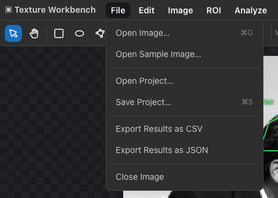
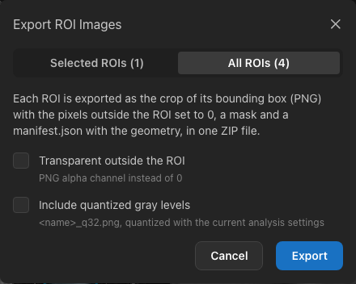
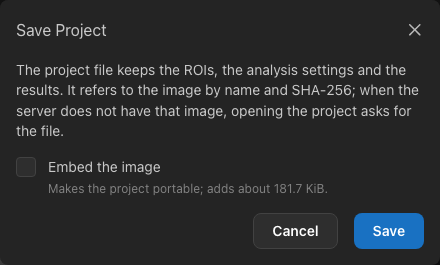

.. _files:

Saving, importing and exporting
===============================

         Results as JSON and Close Image.
   :align: center

   The File menu.

.. list-table::
   :header-rows: 1
   :widths: 30 25 45

   * - To keep
     - Use
     - File
   * - The results table
     - *File ▸ Export Results as CSV / JSON*
     - ``<image>-results.csv`` or ``.json``
   * - The ROIs, to use them again
     - *ROI ▸ Export ROI Set…*
     - ``<image>.roi.json``
   * - The pixels inside the ROIs
     - *ROI ▸ Export ROI Images…*
     - ``<image>-rois.zip``
   * - Everything: ROIs, settings and results
     - *File ▸ Save Project…*
     - ``<image>.glcmproj``

Files are saved by your browser, usually into the Downloads folder.

.. _export-results:

Exporting results
-----------------

*File ▸ Export Results as CSV* (or **Export ▸ CSV** above the Results table) saves all rows of the table:

- The file starts with lines beginning with ``#`` that record the image, its SHA-256 checksum, the software version and
  all settings (gray levels, quantization, distances, directions, aggregation, log base and score).
- Then follows a header row and one row per ROI, distance and direction (or mean and range), with the timestamp, image,
  ROI name and id, status, pixel count, gray levels, quantization, distance, direction, one column per feature, the
  score and the warnings.
- With a pixel spacing, a ``# pixelSpacingMm=`` line gives it (width;height), and an ``areaMm2`` column follows the
  pixel count: the pixel count × pixel width × pixel height.
- Columns of non-standard features end with ``[non-standard]``.
- Numbers are written with full precision.
- Text cells (image and ROI names, ids and warnings) that start with ``=``, ``+``, ``-`` or ``@`` get a leading
  apostrophe, so that spreadsheet programs show them as text instead of running them as formulas. The same applies
  when you copy rows from the Results table.

Most spreadsheet programs open the file directly; if they show the ``#`` lines as data, skip the lines before the
header row when importing.

*Export Results as JSON* saves the same results as a structured ``glcm-results`` document, convenient for scripts.

If the table contains results measured with **different settings** (or on different images), each group is saved as its
own file, and the files are delivered together as a ZIP archive.

.. tip::

   To paste results into a spreadsheet quickly, use **Copy** above the Results table instead; it copies the visible
   columns as tab-separated text.

.. _roi-sets:

ROI sets
--------

*ROI ▸ Export ROI Set…* saves the ROIs of the ROI Manager — names, colors and exact shapes — together with the name,
size and checksum of the image. *ROI ▸ Import ROI Set…* adds the ROIs of such a file to the open image:

- If the ROIs were drawn on a different image (other size, bit depth or file), a warning says so; the ROIs are imported
  anyway.
- ROIs that extend beyond the image are cut at its border; ROIs completely outside it are skipped, and the notification
  lists them.
- The import is one step that :kbd:`⌘Z` / :kbd:`Ctrl+Z` undoes.

This way the same regions can be measured on several images of the same size, or again later with other settings.

Exporting ROI images
--------------------

*ROI ▸ Export ROI Images…* saves the pixels of the ROIs as image files in a ZIP archive:

         quantized gray levels.
   :align: center

   Exporting ROI images.

- Choose **Selected ROIs** or **All ROIs**.
- For each ROI, the archive contains the crop of its bounding box with the pixels outside the ROI set to 0
  (``<name>.png``, or a 16-bit TIFF ``<name>.tif`` for 16-bit images), and its mask ``<name>_mask.png`` (white inside).
- **Transparent outside the ROI** (8-bit images) makes the outside pixels transparent instead of black.
- **Include quantized gray levels** adds ``<name>_q<Ng>.png`` with the gray levels computed with the current analysis
  settings.
- File names come from the ROI names (characters other than letters, digits, ``-``, ``_`` and ``.`` become ``_``).
  When two ROIs would share a file name, for example ROIs named ``a`` and ``a_mask``, ``_2``, ``_3``, ... is appended,
  so no file overwrites another.
- ``manifest.json`` lists every ROI with its shape, bounding box, pixel count and files, or why it was skipped.

Projects
--------

A project keeps a complete session: the image reference, the pixel spacing in use, the ROIs (including hidden ones), the
analysis settings and all finished results.

   Saving a project.

- *File ▸ Save Project…* (:kbd:`⌘S` / :kbd:`Ctrl+S`) saves ``<image>.glcmproj``. The project refers to the image by
  name and checksum. Choose **Embed the image** to include the image file itself, so that the project can be opened on
  another computer or server, or after the image was deleted there. Embedding makes the file about a third larger than
  the image.
- *File ▸ Open Project…* opens a project. If the server still has the image, it is used; otherwise an embedded image is
  uploaded again; otherwise the application asks you to choose the image file. The ROIs, settings and results table of
  the project replace the current ones.

Project and ROI set files can also be dragged onto the window. Files ending in ``.glcmproj`` are opened as projects,
other ``.json`` files are imported as ROI sets.

.. note::

   On a shared server, images and results are deleted after some time (7 days by default). Save a project with the
   image embedded, or export the results, to keep your work.
