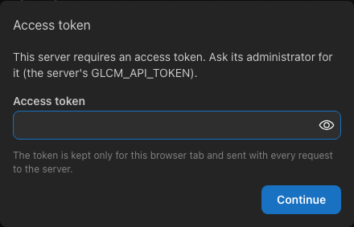
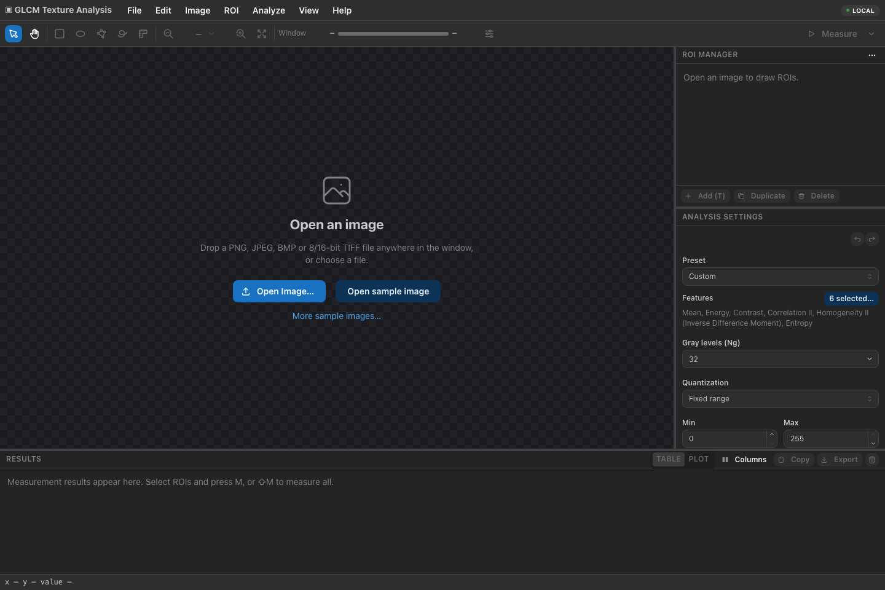
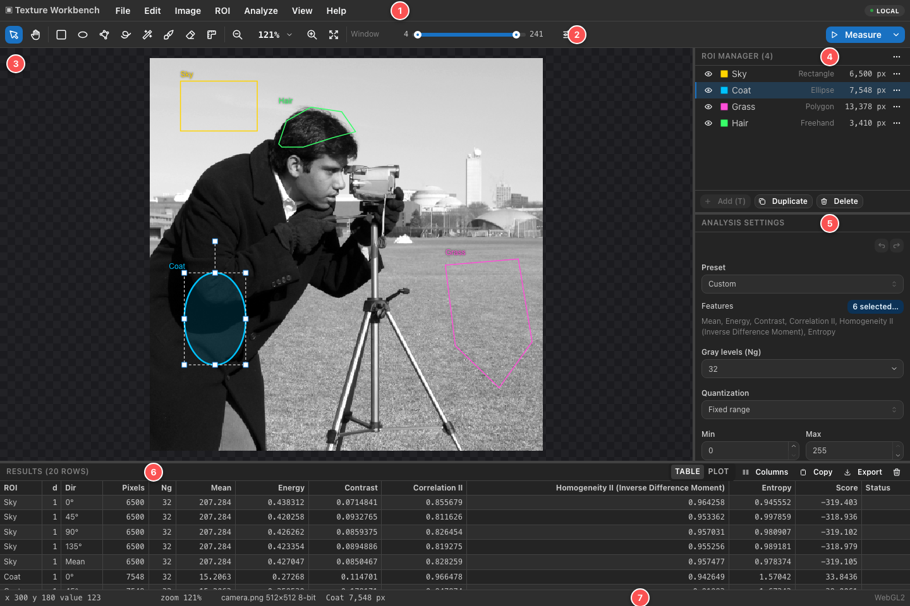

.. _getting-started:

Getting started
===============

Starting the application
------------------------

**On your own computer**, build and start the server once the requirements in ``README.md`` are installed:

.. code-block:: bash

   npm install
   npm run build:native
   npm run build:web
   npm start

Then open http://127.0.0.1:8080 in your browser. The server only accepts connections from this computer, and your
images and results are stored in ``~/.glcm-texture-analysis``. Stop the server with :kbd:`Ctrl+C` in the terminal.

**On a shared server**, open the address your administrator gives you. The first time, the application asks for an
**access token**:

   Servers shared by several people require an access token.

Paste the token and choose **Continue**. The token is kept only for this browser tab; after closing the tab, you are
asked again. To enter a different token, choose *File ▸ Change Access Token…*. On a shared server, uploaded images and
results are usually deleted automatically after some days (7 by default), so export or save what you want to keep
(see :ref:`files`).

Opening an image
----------------

   The start screen.

There are three ways to open an image:

- **Open Image…** on the start screen or in the *File* menu (:kbd:`⌘O` / :kbd:`Ctrl+O`) shows the file dialog.
- **Drag** an image file from your desktop or file manager onto the window.
- **Open sample image** opens ``textures/camera.png``, the cameraman photograph; **More sample images…** (or *File ▸ Open Sample Image…*) lists synthetic
  test patterns, natural textures and medical images (a CT slice, a brain MRI slice and a chest X-ray, all 16-bit).

Supported files are PNG, JPEG, BMP and TIFF with 8 or 16 bits per pixel. The image is uploaded to the server, which
decodes it:

- **Color images** are converted to grayscale, and a notification says so.
- **16-bit images** keep their full intensity range for measurements; the display uses a window (see
  :ref:`window-level`).
- **Limits:** by default an image can have up to 200 MB and 20 000 × 20 000 pixels on your own computer (100 MB and
  10 000 × 10 000 pixels on a shared server). Larger files are rejected with a message.

Opening another image replaces the current one, together with its ROIs; the results table keeps its rows. *File ▸
Close Image* closes the image. *Image ▸ Image Info* shows the file name, size, bit depth, channels, default display
window and SHA-256 checksum of the open image.

.. _main-window:

The main window
---------------

   Areas of the main window.

#. **Menu bar** — *File*, *Edit*, *Image*, *ROI*, *Analyze*, *View* and *Help*. The badge at the right shows
   **Local** on your own computer, or the server name.
#. **Toolbar** — pointer and pan tools, the four ROI tools, zoom, the display window, and **Measure**.
#. **Image canvas** — the image with its ROIs. A navigator appears in the corner when the image is larger than the
   view.
#. **ROI Manager** — the ROIs of the image with their pixel counts.
#. **Analysis Settings** — the features and GLCM parameters used by the next measurement.
#. **Results** — one or more rows for every measured ROI.
#. **Status bar** — the position and value of the pixel under the pointer, the zoom, the image, the selected ROI and
   its pixel count, the progress of running measurements, and how the image is rendered.

The panels can be resized by dragging the borders between them; the side panel (ROI Manager and settings) and the
Results panel can be collapsed by dragging their border all the way. The layout is remembered; *View ▸ Reset Layout*
restores it.
