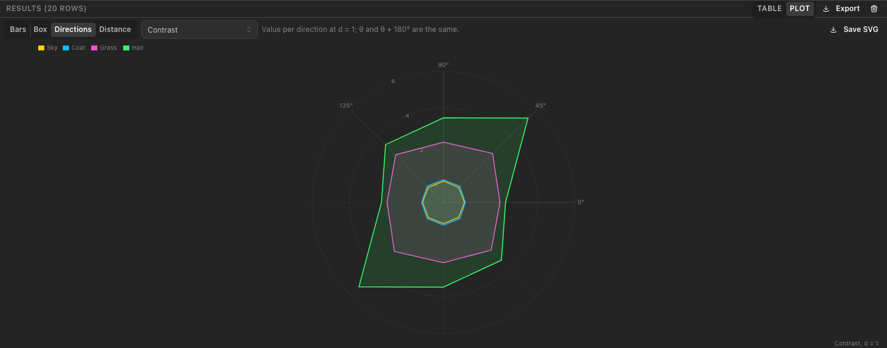

.. _measuring:

Measuring
=========

Analysis settings
-----------------

The **Analysis Settings** panel decides what the next measurement computes. The settings are remembered between
sessions, and results already in the table keep the settings they were measured with.

.. figure:: images/analysis-settings.png
   :alt: The Analysis Settings panel with preset, features, gray levels, quantization, distances, directions and
         aggregation.
   :align: center

   The Analysis Settings panel.

.. list-table::
   :header-rows: 1
   :widths: 22 78

   * - Setting
     - Meaning
   * - **Preset**
     - A named set of features: *Haralick F1–F14*, *Clausi (2002): Contrast, Correlation, Entropy*, *Basic*,
       *Score (Mean, Entropy, Contrast)* (the inputs of the age-based score, with the score switched on) or *All
       features*. Changing the features by hand shows *Custom*. The presets are also in *Analyze ▸ Presets*.
   * - **Features**
     - The features to compute. **N selected…** opens the feature picker.
   * - **Gray levels (Ng)**
     - How many gray levels the intensities are reduced to before the co-occurrence matrix is built: 2–256; the menu
       in the field offers 8, 16, 32, 64, 128 and 256. More levels keep more detail but need larger regions for
       stable values.
   * - **Quantization**
     - How intensities are mapped to gray levels: **Fixed range** (from *Min* to *Max*, the same for every ROI —
       usually the full range of the image), **ROI min–max** (from the lowest to the highest intensity inside each
       ROI), **Fixed bin width** (a fixed number of intensities per gray level) or **None** (intensities are used
       directly and must be below Ng).
   * - **Distances**
     - The distances in pixels between the two pixels of a pair, e.g. ``1, 2, 4``. Each distance is measured
       separately.
   * - **Directions**
     - The directions of pixel pairs: 0° (horizontal), 45°, 90° (vertical) and 135°.
   * - **Aggregation**
     - Which rows the results show per ROI and distance: **Per direction + mean**, **Mean only**, or **Mean + range**
       (mean and range over the directions, as proposed by Haralick in 1973).
   * - **Log base** (Advanced)
     - Natural logarithm, or log₂ to compare entropies with tools such as PyRadiomics or mahotas.
   * - **Age-based score** (Advanced)
     - Adds a *Score* column computed from the age, mean, entropy and contrast with the given coefficients.

Problems with the settings are listed at the bottom of the panel: errors in red prevent measuring, warnings in yellow
point out, for example, that the Maximal Correlation Coefficient is slow for more than 64 gray levels. **Reset to
defaults** restores the default settings (Haralick features, 32 gray levels, full fixed range, distance 1, all
directions).

The **undo** and **redo** buttons at the top of the panel step back and forth through your changes to the settings,
including choosing a preset or resetting to the defaults. Opening a project starts a new history. :kbd:`⌘Z` /
:kbd:`Ctrl+Z` keeps undoing ROI changes only.

.. figure:: images/feature-picker.png
   :alt: The feature picker with a search field and checkboxes grouped into region statistics, Haralick and other
         features; Correlation III and Sum of Squares are marked non-standard.
   :align: center

   The feature picker.

In the **feature picker**, features are grouped as in :doc:`../equations`. Type in the search field to filter them;
**Select all** and **Clear all** apply to the listed features. Two features are marked **⚠ non-standard**
(*Correlation III* and *Sum of Squares (in x and y)*): they follow a formula as printed in a later paper rather than
the original definition; hover the badge for details. Features marked **slow** take noticeably longer for many gray
levels. *Help ▸ Feature Equations* lists every feature by group and opens the equations when the server provides the
built documentation.

.. rubric:: The age-based score

The score combines the age with the mean intensity, entropy and contrast using four coefficients. Its coefficients were
fitted for 8-bit images with 256 gray levels, distance 1 and all four directions. With the **Calibration** profile
(default) its inputs are always computed that way, whatever the other settings are; 16-bit images are first mapped to
0–255 using the display window. With the **Current settings** profile the inputs use the panel's settings, and the
results carry a warning that the coefficients may not apply. **Reset age and coefficients** restores the defaults.

Measuring ROIs
--------------

- **Measure** in the toolbar, :kbd:`M` or *Analyze ▸ Measure Selected* measures the selected ROIs (or the active ROI, if
  none is selected).
- The arrow next to **Measure**, :kbd:`Shift+M` or *Analyze ▸ Measure All* measures every ROI in the ROI Manager.

Each ROI is measured at each distance as a separate job. While jobs run, the status bar shows their progress, for
example *3/8 jobs*; the **×** next to it cancels the measurement (jobs already started still finish, and their results
are kept). You can keep working — drawing ROIs or changing the settings does not affect a running measurement.

Measuring many images
---------------------

*Analyze ▸ Batch Measure…* measures the same ROIs on several images with the current analysis settings:

1. Choose where the ROIs come from: the **ROI Manager** (the ROIs of the open image) or an **ROI set file**
   (``.roi.json``, see :doc:`files`).
2. Choose the **Images** (PNG, JPEG, BMP or TIFF; several at once).
3. Click **Measure N images**.

The images are measured one after another. For each image the dialog lists its status (*Uploading*, *Measuring*,
*Done*, *Skipped*, *Failed* or *Cancelled*) and the finished jobs:

- An image the server already has (same SHA-256) is not uploaded again.
- ROIs are clipped to images of another size, as when importing an ROI set; ROIs that lie entirely outside an image are
  left out, and an image without any ROI on it is *Skipped*.
- The settings are fitted to each image's bit depth, like when opening an image. An image whose settings are invalid,
  or that cannot be read, is marked *Failed* and the batch goes on with the next one.

Each measured image is added to the Results table; once the rows come from more than one image the table shows an
**Image** column. **Cancel batch** stops the running measurement and the images after it. Closing the dialog does not
stop the batch; reopen it to see the progress.

**Download combined CSV** saves the results of every finished image as one CSV file, with the settings as comment lines
once (``# images=`` gives the number of images) and the ``image`` and ``imageSha256`` columns telling the rows apart.
If the images needed different settings, for example 8-bit and 16-bit images with a fixed quantization range, the
download is a ZIP with one CSV per group of settings.

Results
-------

.. figure:: images/results-table.png
   :alt: The Results table with columns ROI, d, Dir, Pixels, Ng, the features, Score and Status.
   :width: 100%

   The Results table.

Every measurement adds rows to the **Results** table:

- One row per **ROI**, **distance** (``d``) and **direction** (``Dir``: 0°, 45°, 90°, 135°, Mean or Range, depending
  on the aggregation), with the **pixel count**, the **area** in mm² (once a measurement had a pixel spacing, see
  :doc:`viewing`), the **gray levels** and one column per feature. The **Score** column
  appears when a measurement included the score.
- Values are shown with six significant digits; copied and exported values have full precision.
- **Status** is empty for normal results, **⚠** when the result has warnings, or *skipped* / *failed* with the reason —
  for example an ROI with fewer than 2 pixels, or intensities above the gray levels when quantization is *None*.
- Hover a row to see the image and settings it was measured with, and its warnings. Hovering also highlights the ROI
  on the canvas; clicking selects it.

Use the buttons above the table to work with it:

- Click a **column header** to sort by it; click again to reverse the order, and a third time to restore the order of
  measurement.
- **Columns** shows or hides columns.
- **Copy** copies the table (visible columns, current order) as tab-separated text, ready to paste into a spreadsheet.
  Text cells starting with ``=``, ``+``, ``-`` or ``@`` get a leading apostrophe, so the spreadsheet does not run them
  as formulas.
- **Export** saves the results as CSV or JSON (see :ref:`export-results`).
- The trash button clears the table (*Analyze ▸ Clear Results*).

Plots
~~~~~

**Plot** (next to **Table** above the results) draws one feature of the measurements as a chart; choose the feature
from the list next to the chart types:

- **Bars**: one bar per ROI with the mean over the directions at one distance (choose it when you measured several);
  the whiskers span the values of the single directions.
- **Box**: per ROI, the values of every measured direction at every distance, as the median, the quartiles (linear
  interpolation) and the range.
- **Directions**: a polar plot of the value in each direction at one distance. A co-occurrence matrix counts both
  neighbours of each pixel, so θ and θ + 180° have the same value and the shape is symmetric; an elongated shape shows
  directional texture. The rings are labelled with their values, and the centre is not zero.
- **Distance**: the mean over the directions against the distance ``d``, one line per ROI.

   Contrast per direction for four ROIs.

Each ROI keeps its colour from the ROI Manager, and hovering its bar, box or line highlights the ROI on the canvas.
When an ROI was measured more than once at the same distance, the latest measurement is plotted; after a batch, the
series are named after the image and the ROI. **Save SVG** saves the chart as an SVG file.

.. note::

   The first-order statistics (Mean, Std, Minimum to Kurtosis) are computed from the original intensities of the ROI.
   First-order Entropy and Uniformity, the co-occurrence features, and the run length and size zone features use the
   quantized gray levels, so they depend on the gray levels and quantization settings. Run length and size zone features
   do not depend on the distance: every distance gives the same values. Size zone features have no direction either. The formulas are listed in
   :doc:`../equations`.
