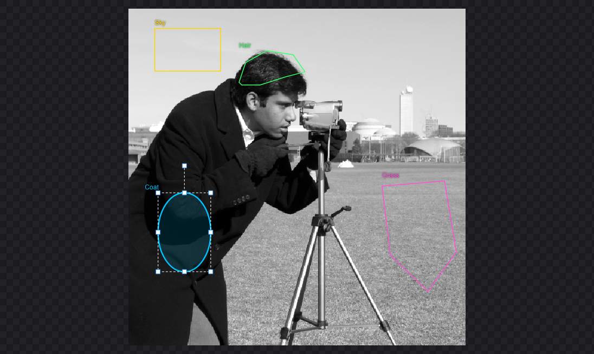
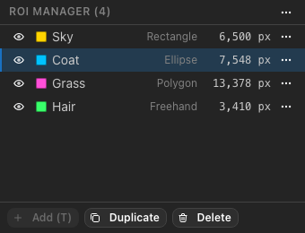

.. _rois:

Regions of interest
===================

A region of interest (ROI) is the part of the image that is measured. ROIs are drawn on the canvas, kept in the ROI
Manager, and measured together or one by one.

         (Grass) and a freehand ROI (Hair), each labeled with its name.
   :width: 100%

   Four ROIs with labels. The selected ROI ("Coat") shows handles for resizing and rotating.

Drawing ROIs
------------

Choose a tool in the toolbar, in the *ROI* menu or with its key, then draw on the image:

.. list-table::
   :header-rows: 1
   :widths: 20 12 68

   * - Tool
     - Key
     - How to draw
   * - Rectangle
     - :kbd:`R`
     - Drag from one corner to the opposite corner. Hold :kbd:`Shift` for a square.
   * - Ellipse
     - :kbd:`E`
     - Drag the bounding box of the ellipse. Hold :kbd:`Shift` for a circle.
   * - Polygon
     - :kbd:`P`
     - Click each vertex. Close the polygon by double-clicking, pressing :kbd:`Enter`, or clicking the first vertex
       again. :kbd:`Backspace` removes the last vertex; :kbd:`Esc` cancels.
   * - Freehand
     - :kbd:`F`
     - Press, trace the outline and release. The outline is simplified slightly and kept as a polygon.

A newly drawn shape has a **dashed white outline**: it is the *active* ROI and not yet part of the ROI Manager. Press
:kbd:`T` (or **Add (T)** in the ROI Manager, or *ROI ▸ Add to Manager*) to add it. It then gets a name ("ROI 1",
"ROI 2", …) and its own color. Drawing another shape replaces an active ROI that was not added.

If you measure while an active ROI exists and no ROI is selected, the active ROI is added automatically and measured.

.. tip::

   ROIs are placed in image pixel coordinates, independent of the zoom. Zoom in to draw small ROIs precisely.

Which pixels belong to an ROI
-----------------------------

A pixel belongs to an ROI when the **center of the pixel** lies inside the shape. The pixel count shown for each ROI is
computed this way by the same code that measures, so it always matches the measurement. Parts of an ROI outside the
image are ignored.

An ROI with fewer than 2 pixels cannot be measured; the ROI Manager marks it with ⚠. Measurements also warn when an ROI
has no pixel pairs in a direction at the chosen distance — for example, a one-pixel-high rectangle has no vertical
pairs.

Selecting and editing ROIs
--------------------------

Choose the **Pointer** tool (the arrow in the toolbar) to work with existing ROIs:

- **Select** an ROI by clicking inside or on its outline. Hold :kbd:`Shift`, :kbd:`⌘` or :kbd:`Ctrl` to add or remove
  ROIs from the selection. Click an empty area to clear the selection. *Edit ▸ Select All ROIs* (:kbd:`⌘A` /
  :kbd:`Ctrl+A`) selects all.
- **Move** the selected ROIs by dragging one of them, or with the arrow keys (1 pixel; :kbd:`Shift` for 10 pixels).
- **Resize** a selected rectangle or ellipse with its handles; **rotate** an ellipse with the handle above it.
- **Edit a polygon:** select it to show its vertices. Drag a vertex to move it, double-click an edge to add a vertex,
  or :kbd:`Alt`-click a vertex to remove it (a polygon keeps at least 3 vertices).
- **Delete** the selected ROIs with :kbd:`Delete` or :kbd:`Backspace`.

Hovering over an ROI highlights it and, after a moment, shows a tooltip with its name, shape and pixel count. *View ▸
Show ROI Labels* shows every ROI's name next to it.

**Undo and redo:** *Edit ▸ Undo* (:kbd:`⌘Z` / :kbd:`Ctrl+Z`) and *Edit ▸ Redo* (:kbd:`⌘⇧Z` / :kbd:`Ctrl+Shift+Z`)
cover adding, deleting, renaming, moving, resizing, rotating, vertex edits and imports — up to 200 steps. Opening
another image clears the history.

The ROI Manager
---------------

   The ROI Manager.

Each row shows, from left to right:

- **visibility** (the eye) — hidden ROIs are not drawn, but they can still be selected here and measured;
- **color** and **name** — double-click the name to rename it, then press :kbd:`Enter`;
- **shape** — Rectangle, Ellipse, Polygon or Freehand;
- **pixel count**, or ⚠ with an explanation when the ROI cannot be measured;
- a **menu** (⋯) with *Zoom to ROI*, *Rename*, *Duplicate* and *Delete*.

Click a row to select the ROI; :kbd:`⌘`/:kbd:`Ctrl`-click to add it to the selection; :kbd:`Shift`-click to select a
range. The selection and the highlighted ROI are the same on the canvas and in the manager.

The buttons below the list add the active ROI, duplicate the selected ROIs (the copies are moved by 10 pixels) and
delete the selected ROIs. The menu at the top right shows or hides all ROIs, and imports and exports ROI sets (see
:ref:`roi-sets`).
