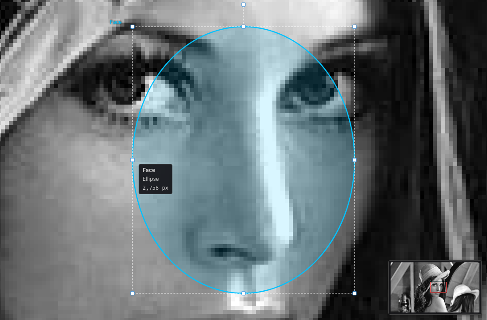
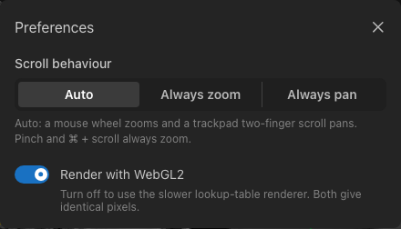
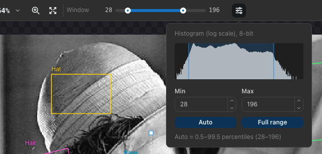

.. _viewing:

Viewing images
==============

Zooming and panning
-------------------

When an image opens, it is fitted into the canvas. The zoom ranges from 5 % to 3200 %; above 100 % pixels are drawn as
sharp squares, so individual pixels can be inspected.

.. list-table::
   :header-rows: 1
   :widths: 35 65

   * - To
     - Do this
   * - Zoom around the pointer
     - Scroll the mouse wheel, or pinch on a trackpad
   * - Zoom in or out around the center
     - :kbd:`+` / :kbd:`−`, the zoom buttons in the toolbar, or *Image ▸ Zoom In / Zoom Out*
   * - Show 100 % or fit the image
     - :kbd:`1` / :kbd:`0`, the zoom menu in the toolbar, or *Image ▸ Zoom 100 % / Fit to Window*
   * - Pan
     - Scroll with two fingers on a trackpad; drag while holding :kbd:`Space`; drag with the middle mouse button; or
       choose the **Pan** tool (hand) and drag
   * - Pan with the keyboard
     - Arrow keys (50 pixels on screen); :kbd:`Shift` + arrow keys move by a whole view
   * - Zoom to the selected ROIs
     - :kbd:`Z` or *Image ▸ Zoom to Selection*

   Zoomed in on an ROI. The navigator (lower right) shows where the view is; hovering an ROI shows its name, shape and
   pixel count.

**Navigator:** when the image does not fit into the canvas, a small overview appears in the lower right corner. The red
rectangle marks the visible part: drag it to move the view, or click anywhere in the overview to center the view there.
Press :kbd:`N` or choose *View ▸ Show Navigator / Hide Navigator* to show or hide it.

**Mouse wheel or trackpad:** the application tells a mouse wheel (which zooms) from two-finger trackpad scrolling (which
pans). If your device is recognized the wrong way, choose *Edit ▸ Preferences…* and set **Scroll behaviour** to
*Always zoom* or *Always pan*. Holding :kbd:`⌘` or :kbd:`Ctrl` while scrolling always zooms.

   Preferences.

Pixel values
------------

The status bar shows the column (``x``), row (``y``) and value of the pixel under the pointer. Values are those of the
stored image: 0–255 for 8-bit images and 0–65535 for 16-bit images, after conversion to grayscale for color images.
Column 0, row 0 is the upper left pixel.

.. _window-level:

Display window (window/level)
-----------------------------

The display window chooses which intensities are shown from black to white. Intensities below the window are black and
those above it white. Changing the window **only changes the display**; measurements always use the stored intensities.

         Auto and Full range buttons.
   :align: center

   The window slider and its settings.

- Drag the two handles of the **Window** slider in the toolbar.
- Choose the settings button next to the slider (or *Image ▸ Window/Level ▸ Custom…*) to see the histogram of the whole
  image, type exact **Min** and **Max** values, or choose:

  - **Auto** — from the 0.5th to the 99.5th percentile of the intensities (the window used when the image opens);
  - **Full range** — 0–255 or 0–65535.

The histogram uses a logarithmic scale so that rare intensities stay visible; the shaded band is the window.

.. note::

   Images up to 4096 × 4096 pixels are rendered by your browser, so the window follows the slider immediately. Larger
   images are rendered by the server, and the view updates a moment after you stop moving the slider. The status bar
   shows which is used (*WebGL2*, *Lookup table* or *Server rendering*).
